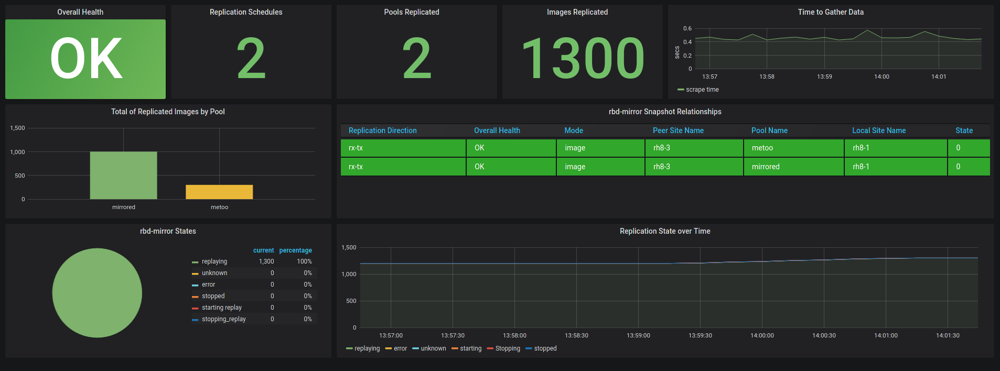

rbd-mirror-stats
================

This is just a POC project looking at the kinds of metrics that can be extracted from snapshot based rbd-mirror. The
intent is to use this project to refine the requirements and use case before making the necessary updates to the 
mgr/prometheus module in the main Ceph project.

How to Test
-----------
1. Create two clusters, and define snapshot based mirroring between them for one or more pools
   1.1 Refer to the [docs](https://docs.ceph.com/en/latest/rbd/rbd-mirroring/)

2. copy the rbd-mirror-scrape.py script to a cluster node's ``/var/lib/ceph/\<fsid\>/home`` directory

3. start a cephadm shell

4. start the script
   ~~~
   # python3 rbd-mirror-scrape.py
   ~~~
5. Look at your data with curl
   ~~~
   curl http://localhost:9289/metrics
   ~~~

For extra geek-out points, use Ceph's monitoring stack or your own prometheus/grafana to scrape the endpont, and load the ``rbd-mirror-dashboard.json`` file to view the data.  
&nbsp;  

&nbsp;  

What does it do?
----------------
The script starts a basic web server on port 9289, responding to GET requests. When a GET is received, a 'collect' method runs that will generate rbd-mirror
metrics based on rbd CLI commands.

The commands are structured into a flow, which begins with a snapshot schedule.
~~~
Get a list of pools with a schedule
For each pool in the list
    Fetch the current rbd-mirror summary state (mirror pool status)
    Fetch the current rbd-mirror config
    Generate the metrics
        Metadata (replication relationship)
        State (image counts and states)
~~~

The obvious implication of the above, is...no schedule == no data

Example Output
--------------

~~~
[root@rh8-1 ~]# curl localhost:9289/metrics
# HELP rbd_mirror_snapshot_metadata metadata relating to rbd-mirror relationship
# TYPE rbd_mirror_snapshot_metadata gauge
rbd_mirror_snapshot_metadata{pool_name="mirrored",mode="image",site_name="rh8-1",peer_site="rh8-3",uuid="ba4380b9-e2bd-4f79-8c8e-e0a10b4a7fdb",mirror_uuid="1635ca5b-5ed4-4b31-8631-c32f587875f6",direction="rx-tx"} 1.0
# HELP rbd_mirror_snapshot_health health information for image and local/remote daemons
# TYPE rbd_mirror_snapshot_health gauge
rbd_mirror_snapshot_health{pool_name="mirrored",health="OK",daemon_health="OK",image_health="OK"} 0.0
# HELP rbd_mirror_snapshot_image_state count of images in a given rbd-mirror state
# TYPE rbd_mirror_snapshot_image_state gauge
rbd_mirror_snapshot_image_state{pool_name="mirrored",status="unknown"} 0.0
rbd_mirror_snapshot_image_state{pool_name="mirrored",status="error"} 0.0
rbd_mirror_snapshot_image_state{pool_name="mirrored",status="syncing"} 0.0
rbd_mirror_snapshot_image_state{pool_name="mirrored",status="starting_replay"} 0.0
rbd_mirror_snapshot_image_state{pool_name="mirrored",status="replaying"} 1699.0
rbd_mirror_snapshot_image_state{pool_name="mirrored",status="stopping_replay"} 0.0
rbd_mirror_snapshot_image_state{pool_name="mirrored",status="stopped"} 0.0
# HELP rbd_mirror_snapshot_schedules count of snapshot schedules defined against a pool
# TYPE rbd_mirror_snapshot_schedules gauge
rbd_mirror_snapshot_schedules{pool_name="mirrored"} 1.0
# HELP rbd_mirror_snapshot_scrape_seconds temporary metric for POC testing
# TYPE rbd_mirror_snapshot_scrape_seconds gauge
rbd_mirror_snapshot_scrape_seconds 0.6501190662384033
~~~